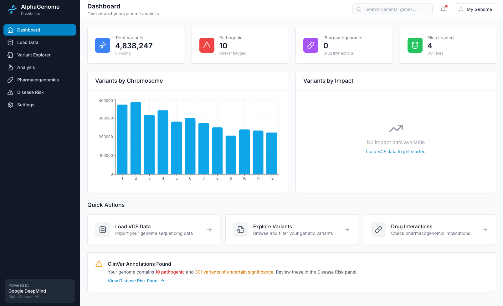
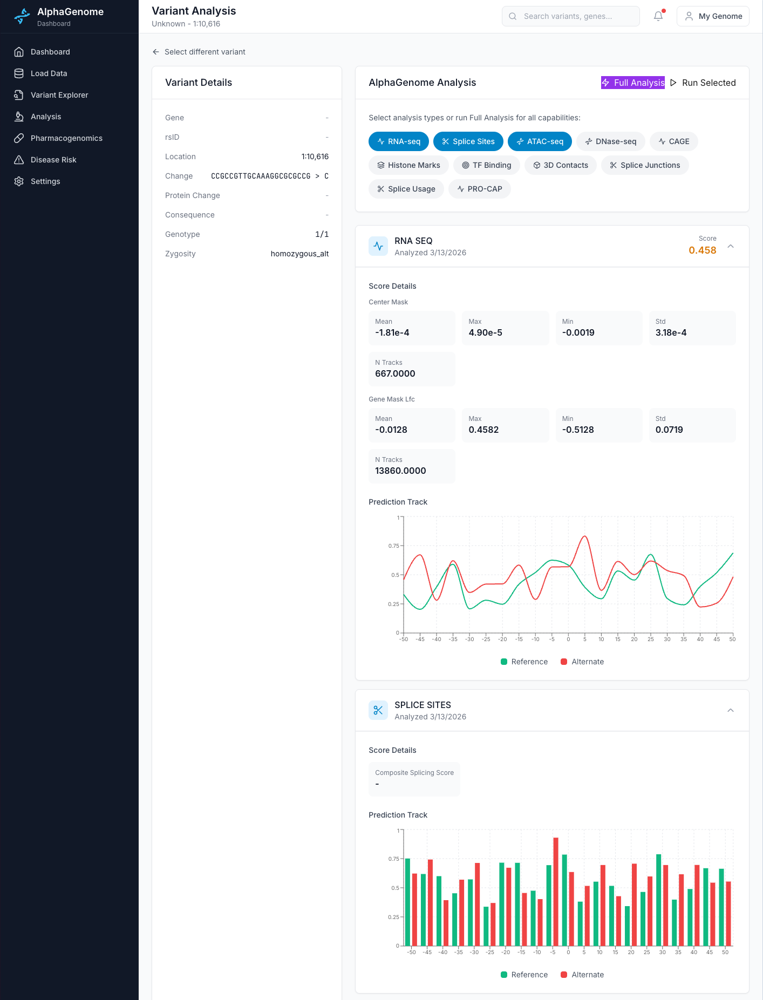

# AlphaGenome Personal Genome Analysis Dashboard

A web dashboard for analyzing whole genome sequencing data using Google DeepMind's AlphaGenome API, with ClinVar and PharmGKB annotations.





**[User Guide](docs/USER_GUIDE.md)** - How to use each section and interpret the data

## Features

- **VCF File Loading**: Import and parse VCF files from whole genome sequencing (SNP, indel, CNV, SV)
- **VCF Annotation Pipeline**: Built-in SnpEff annotation script adds gene symbols, consequences, and impact to unannotated VCFs
- **Variant Explorer**: Browse, filter, and search millions of variants with pagination
- **AlphaGenome Analysis**: Deep analysis of variants using DeepMind's genomic AI model
- **Disease Risk Panel**: View pathogenic and likely pathogenic variants from ClinVar, with clickable disease ID badges linking to OMIM, MedGen, Orphanet, MONDO, HPO, and MeSH
- **Pharmacogenomics**: Drug-gene interaction analysis from PharmGKB (matches by gene symbol and rsID)
- **Position-based Annotation Matching**: ClinVar lookup by chromosome + position + ref + alt (works without rsIDs)
- **CNV/SV Support**: Handles symbolic alleles (`<DEL>`, `<DUP>`, `<INV>`) and breakend notation

## Prerequisites

- Python 3.10+
- Node.js 18+
- AlphaGenome API key (get from [DeepMind](https://deepmind.google.com/science/alphagenome/account/settings))

## Quick Start

### 1. Clone and Setup

```bash
cd alphagenome

# Install all dependencies
npm install
```

### 2. Configure Environment

Create a `.env` file in the root directory (or edit the existing one):

```env
# AlphaGenome API Configuration
ALPHAGENOME_API_KEY=your_api_key_here
ALPHAGENOME_PROJECT_ID=your_project_id_here

# Genome assembly (GRCh37 or GRCh38) — must match your VCF alignment
GENOME_ASSEMBLY=GRCh37

# Optional: Database location (defaults to ./data/alphagenome.db)
DATABASE_URL=sqlite:///./data/alphagenome.db
```

### 3. Place Your VCF Files

Copy your VCF files (with tabix indexes) to the `data/vcf/` directory:

```bash
cp /path/to/your/*.vcf.gz /path/to/your/*.vcf.gz.tbi data/vcf/
```

Supported file types:
- `.vcf` and `.vcf.gz` (gzipped recommended for WGS-scale data)
- SNP, indel, CNV, and SV VCFs (including symbolic alleles like `<DEL>`, `<DUP>`)
- Works with unannotated VCFs (no rsIDs or VEP/SnpEff annotations required)

### 4. Annotate Your VCFs (Recommended)

Raw VCFs from sequencing pipelines (e.g., DRAGEN, GATK) typically lack gene symbols, consequences, and rsIDs. Without annotations, the Variant Analysis, Pharmacogenomics, and Disease Risk panels will have limited data.

Run the built-in annotation script to add SnpEff annotations:

```bash
./scripts/annotate_vcf.sh
```

This will:
1. Download **SnpEff** and the **GRCh37.75** genome database automatically
2. Install **bcftools** via Homebrew (for indexing)
3. Annotate your `*.filtered.snp.vcf.gz` and `*.filtered.indel.vcf.gz` files
4. Output `*.annotated.vcf.gz` files in `data/vcf/`

The annotated VCFs will have:
- **Gene symbols** (e.g., BRCA1, CYP2D6)
- **Consequences** (e.g., missense_variant, stop_gained)
- **Impact levels** (HIGH, MODERATE, LOW, MODIFIER)
- **Transcript and protein change** information

> **Note**: Requires Java 8+ and Homebrew (macOS). The SNP file annotation takes ~10 minutes for a typical whole-genome VCF. CNV and SV files are skipped as they are not suitable for SnpEff annotation.

After annotation, load the new `.annotated.vcf.gz` files from the Load Data page.

### 5. Start the Application

```bash
# Start both backend and frontend
npm start
```

Or run them separately:

```bash
# Terminal 1: Start backend
npm run backend

# Terminal 2: Start frontend
npm run frontend
```

The application will be available at:
- **Frontend**: http://localhost:5173
- **Backend API**: http://localhost:8000

## Project Structure

```
alphagenome/
├── backend/                 # Python FastAPI backend
│   ├── api/routes/         # API endpoints
│   ├── db/                 # Database configuration
│   ├── models/             # SQLAlchemy & Pydantic models
│   └── services/           # Business logic
├── frontend/               # React TypeScript frontend
│   └── src/
│       ├── components/     # Reusable UI components
│       ├── hooks/          # React Query hooks
│       ├── pages/          # Page components
│       ├── services/       # API client
│       └── types/          # TypeScript definitions
├── data/
│   ├── vcf/               # Place your VCF files here
│   └── annotations/       # ClinVar & PharmGKB data
├── scripts/               # Setup & download scripts
└── .env                   # Configuration
```

## Backend API Endpoints

### Files
- `GET /api/files` - Discover VCF files in data directory
- `GET /api/files/loaded` - List loaded VCF files
- `POST /api/files/{filename}/parse` - Parse and load a VCF file

### Variants
- `GET /api/variants` - List variants (paginated, filterable)
- `GET /api/variants/{id}` - Get variant details
- `GET /api/variants/stats` - Get variant statistics

### Analysis
- `POST /api/analysis/score` - Score variant with AlphaGenome
- `POST /api/analysis/batch` - Batch score multiple variants
- `GET /api/analysis/{variant_id}` - Get analysis results

### Annotations
- `GET /api/annotations/panels/disease-risk` - Disease risk panel
- `GET /api/annotations/panels/pharmacogenomics` - Pharmacogenomics panel
- `POST /api/annotations/clinvar/load` - Load ClinVar data
- `POST /api/annotations/pharmgkb/load` - Load PharmGKB data
- `GET /api/annotations/clinvar/rsid/{rsid}` - ClinVar lookup
- `GET /api/annotations/pharmgkb/rsid/{rsid}` - PharmGKB lookup

## Downloading Annotation Databases

Both ClinVar and PharmGKB must be downloaded and loaded for the Disease Risk and Pharmacogenomics panels to show results.

### ClinVar

ClinVar provides variant-disease associations. Download and load:

```bash
# Download ClinVar data
python scripts/download_clinvar.py

# Load into database (defaults to GRCh37 assembly)
curl -X POST "http://localhost:8000/api/annotations/clinvar/load?assembly=GRCh37"
```

### PharmGKB

PharmGKB provides drug-gene interaction data. It requires a free download from their website:

1. Visit https://www.pharmgkb.org/downloads
2. Download **clinicalVariants.zip** (under "Clinical Variant Data")
3. Extract `clinicalVariants.tsv` into `data/annotations/pharmgkb/`
4. Load into database:

```bash
curl -X POST "http://localhost:8000/api/annotations/pharmgkb/load"
```

The loader supports both `clinicalVariants.tsv` and `var_drug_ann.tsv` formats and splits multi-drug entries into individual records for proper matching.

## Development

### Backend Development

```bash
cd backend
pip install -r requirements.txt
uvicorn main:app --reload --host 0.0.0.0 --port 8000
```

### Frontend Development

```bash
cd frontend
npm install
npm run dev
```

## Tech Stack

### Backend
- **FastAPI** - Modern Python web framework
- **SQLAlchemy** - Database ORM
- **SQLite** - Local database
- **cyvcf2/pysam** - VCF parsing
- **AlphaGenome SDK** - DeepMind genomic analysis

### Frontend
- **React 18** - UI framework
- **TypeScript** - Type safety
- **Vite** - Build tool
- **Tailwind CSS** - Styling
- **React Query** - Data fetching
- **Recharts** - Visualizations
- **React Router** - Navigation

## Design Notes

- **Position-based annotation matching**: Most WGS pipelines produce VCFs without rsIDs. ClinVar and variant stats use chromosome + position + ref + alt matching as the primary strategy, with rsID lookup as a fallback when available.
- **Dual pharmacogenomics matching**: The pharmacogenomics panel uses two strategies: gene-symbol matching (for annotated VCFs) and rsID matching against PharmGKB (for unannotated VCFs with dbSNP IDs). This ensures results regardless of annotation status.
- **GRCh37 default**: The genome assembly is configurable (`GENOME_ASSEMBLY` env var) but defaults to GRCh37, which is still the most common WGS alignment target. ClinVar is filtered to the configured assembly during loading.
- **Background loading**: VCF parsing and ClinVar/PharmGKB ingestion run as FastAPI background tasks to avoid blocking the API during multi-million-row loads.
- **Symbolic allele handling**: The VCF parser recognizes `<DEL>`, `<DUP>`, `<DUP:TANDEM>`, `<INS>`, `<INV>`, `<CNV>`, and breakend notation rather than misclassifying them by ref/alt string length comparison.
- **Disease ID linking**: Disease IDs from ClinVar (OMIM, MedGen, Orphanet, MONDO, HPO, MeSH) are rendered as clickable badges linking directly to their respective databases. Handles pipe/comma-separated and double-prefix formats.

## Data Privacy

All data processing happens locally on your machine. VCF data and analysis results are stored in a local SQLite database. The only external API calls are to the AlphaGenome service for variant scoring.

## License

For personal use only. See AlphaGenome terms of service for API usage.

## Acknowledgments

- [Google DeepMind AlphaGenome](https://deepmind.google.com/science/alphagenome/)
- [ClinVar](https://www.ncbi.nlm.nih.gov/clinvar/)
- [PharmGKB](https://www.pharmgkb.org/)
